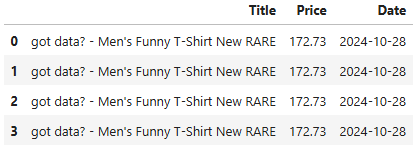

# Python Ebay Web Scraping
Checks the product price intermittently, for a product on ebay.

## Tools and technologies
- **Jupyter Notebook**
- **Python**
  - pandas
  - beautifulsoup
  - requests
  - time
  - datetime
  - csv
  - os

## Programming steps
- Connected to the ebay product page to webscrape
- Got the html from the page
- Got the title and price of the product
- Removed currency from the price
- Made a csv file with the webscraped data along with the current time
- Combined functionality into check_price function that gets the products current price and inserts it as a new row to the csv file
- Ran check_price function intermittently
- Checked the content of the csv file

 ## Visuals
**CSV file with product name, price and date**

 ## Code
 [Ebay Web Scraping](ebay_web_scraping.ipynb)
